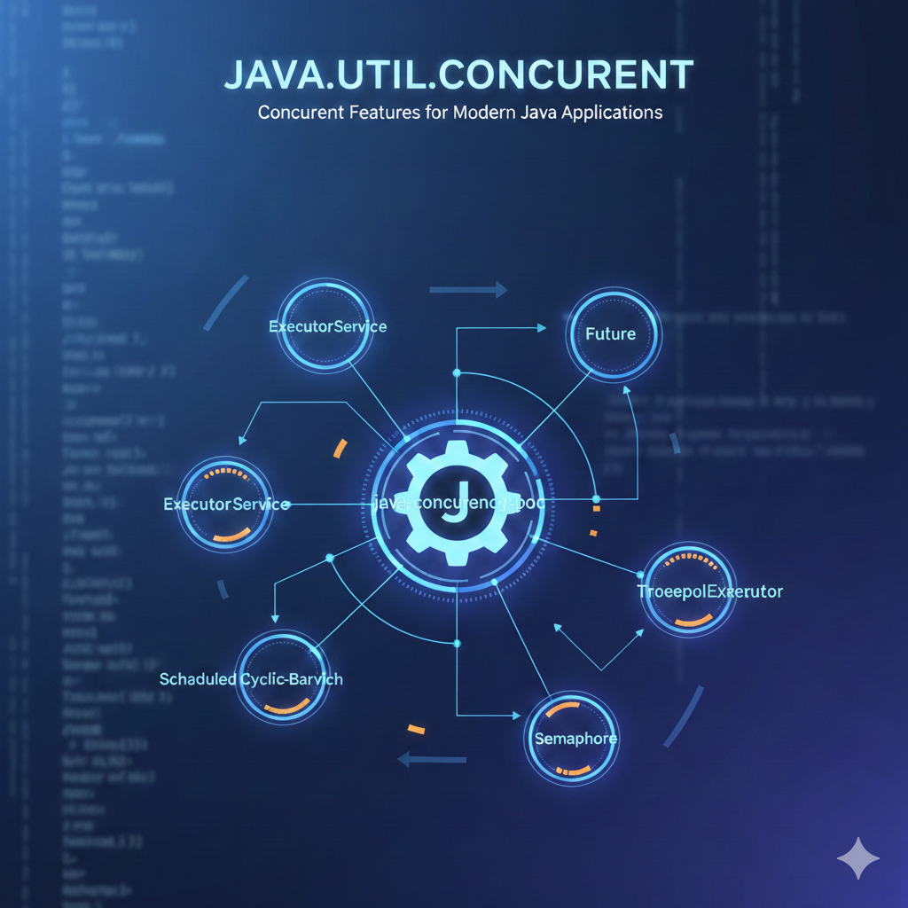

# POC Java Concurrency




This repository contains a Proof of Concept focused on Callable and Future, two core concurrency abstractions in Java. The goal is to provide a clear and practical understanding of how asynchronous tasks are executed, how results are retrieved, and how errors are handled in a controlled way.

The examples are intentionally simple and written for study purposes, closely resembling how a developer would write and reason about concurrent code in real projects.

## Objectives

- Understand the difference between Runnable and Callable

- Learn how to execute tasks asynchronously using ExecutorService
  
- Retrieve results using Future

- Handle exceptions produced by asynchronous tasks

- Work with state and shared data safely


## Structure - Where the thread pool lives

Pool Threads

Each pool thread:

- Is an operating system thread

- Created within the JVM process

- Has:

    - Its own stack (native memory)

    - Internal metadata

This stack is not located on the heap, but it counts towards the total memory consumption of the process.

````

JVM Process
│
├── Heap
│   ├── ThreadPoolExecutor
│   ├── BlockingQueue
│   ├── Runnable / Callable
│
├── Metaspace
│   ├── Loaded classes
│
├── Native memory
│   ├── Stack Thread 1
│   ├── Stack Thread 2
│   ├── Stack Thread 3
│   └── Stack Thread 4
````

### Callable

#### What is Callable?

Callable<V> represents a task that:

- Is executed asynchronously

- Returns a value

- Can throw checked or unchecked exceptions

````java
V call() throws Exception;
````

Callable is conceptually similar to Runnable, but with two important differences:

- It returns a result

- It supports exception propagation

Because of this, Callable is preferred whenever the result of a task matters.


#### Why Callable Exists

Before `Callable`, Java provided only `Runnable`, which:

- Does not return a result
- Cannot throw checked exceptions

This makes `Runnable` unsuitable for tasks where:
- The result of the computation matters
- Failure must be explicitly handled

`Callable` was introduced to solve exactly these limitations.

### Future

#### What is Future?

Future<V> represents the result of an asynchronous computation. It acts as a handle that allows the caller to:

- Retrieve the result of a task

- Check if the task has completed

- Cancel the task

- Handle execution failures

The most common operation is get(), which blocks until the result is available.

````java
V result = future.get();
````
If the Callable throws an exception, it is wrapped inside an ExecutionException and rethrown by get().

⚠️ Important:
Calling `future.get()` is a **blocking operation**.

If the task has not completed:
- The calling thread is parked
- CPU is not used, but the thread is blocked
- This can become a scalability bottleneck if misused

### ExecutorService

Callable tasks are not executed directly. Instead, they are submitted to an ExecutorService, which manages thread creation, reuse, and scheduling.

````java
ExecutorService executor = Executors.newFixedThreadPool(2);
Future<String> future = executor.submit(callable);
````

### ExecutorService Lifecycle

ExecutorService must always be shut down explicitly.

Failing to do so may:
- Prevent JVM shutdown
- Leak threads
- Consume native memory unnecessarily

Always call:
```java
executor.shutdown();
Using ExecutorService avoids manual thread management and is the recommended approach in production systems.

### Examples Included in This POC

This POC includes several Callable implementations, each designed to demonstrate a specific concept:

- Simple Callable returning a value

- Callable with constructor parameters

- Callable simulating delayed execution

- Callable that throws an exception

- Callable wrapping a Supplier

- Callable with shared state using AtomicInteger

- Callable performing data transformation

Each example is executed and tested in the main application class using Future.

### Exception Handling

Exceptions thrown inside a Callable do not propagate directly. Instead:

- The Callable throws the exception

- The ExecutorService captures it

- The Future rethrows it wrapped in an ExecutionException

This requires explicit handling when calling future.get().

#### Key Concepts Demonstrated

- Asynchronous task execution

- Blocking vs non-blocking behavior

- Safe state sharing between threads

- Separation of task definition and execution

- Proper shutdown of ExecutorService

#### Recommended Study Order

1. Callable vs Runnable

2. ExecutorService basics

3. Future.get() and blocking behavior

4. Exception handling with ExecutionException

5. Shared state and thread safety

